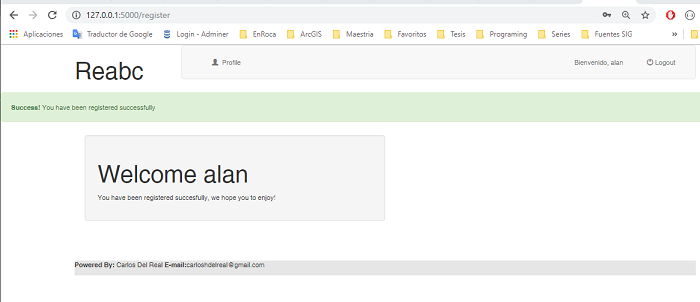
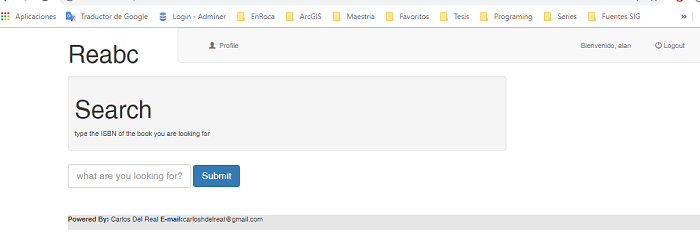
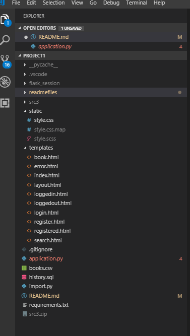

# Project 1 Books Web Application

in this web application are demonstrated a series of programming skills using python.

## Using the Website, registration, search and review

The webapp allows to the registration for new users, once you access to the webpage a welcome message is presented and a link to the log in page.

up to the right are two icons that has links to the login and register page respectively. once you click register you are allowed to register in the website by putting you name, email, user and password.

once you are registered a message of success is displayed as well as a wellcome banner and you are logged in. once logged the icons in the navbar changes and now you can go further to the application or simply log out.

once you click in the user or profile logo you are taken to the index page where a link to the search page is displayed.

in the search page you are commited to type an isbn, title or author for performing the search. once you type any string the search is performed and a table just below the text field presents the results or a message if there where no results.

once you click in the isbn of any book you are taken to the book's page in wich information about the book is presented, the number of rates, reviews, etc, and this information is retrieved from the goodreads website. also you are allowed to rate the book and write a review. down below in the page reviews of other users are presented as well as the rates, once you submit a review you can update it but not you are able to put just one review per book.

finally you can use the api by accessing to the url `/api/<isbn>`

## The contents of the files

there are pesented ten templates that allow to present the different stages of the webapp as well as handling the different situations with and without user loggedin. the application file contains all the logic that governs the application an intends to handle all the possible scenarios to avoid the crash of the application for some entry, the import.py is an stand alone script whose purpose in life is to load the books.csv file into the database.

