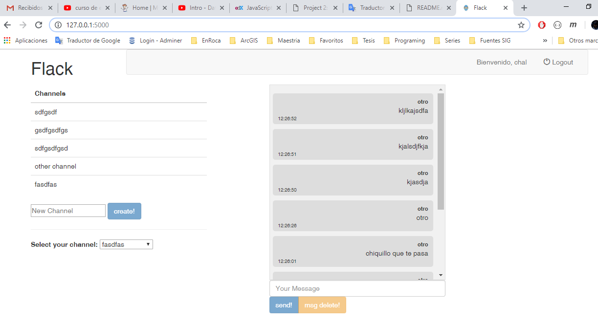
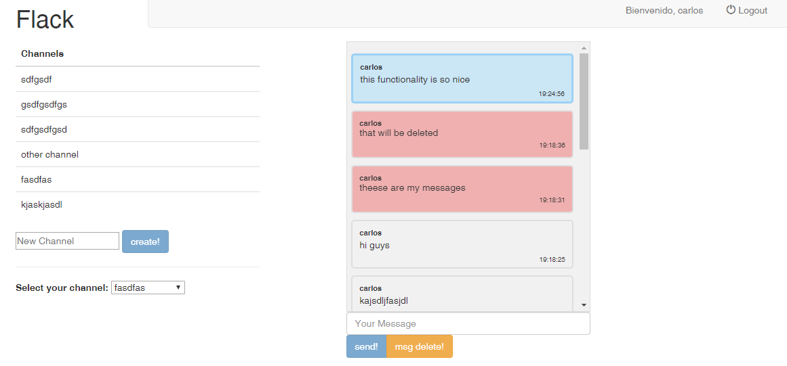

# Project 2

## Flack

Flack is a web application that allows users to create chat channels and send messages through those channels.

once you access the webpage a model is displayed forcing the user to put a name to be identified for the page, this variable is stored locally and the user name is always recorded for the web browser even after closing the browser. 

once you provide a name, the webpage welcomes and put your name in the nav bar, next to your name is a logout button that allows you to log out and eventually log in with a different username.

In the left hand side you will have the channels already created and you are able to create new channels an select wich one you want to use. the messages are updated once you change your selected channel.

At the right hand side you will have the chat, all your messages are displayed different that the ones sent by other users, if you select some of the messages sent by you, the msg delete button will be enabled and you can delete those inapropiate messages that you don't want to see, those will be deleted as well from the server so won't be available anymore.

